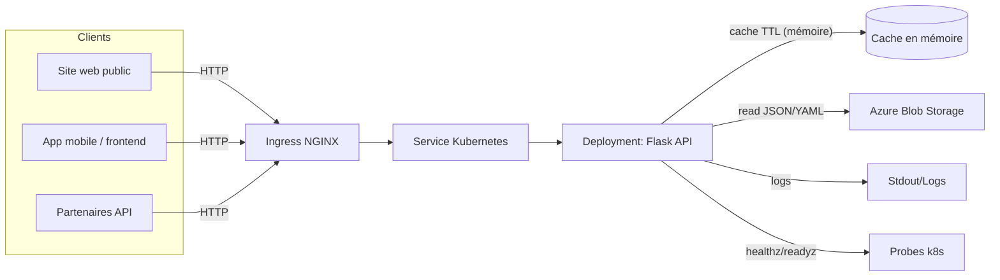

# Architecture globale

## Contexte & contraintes

Le contenu éditorial (événements, news, FAQ) est stocké dans **Azure Blob Storage** sous forme de fichiers **JSON/YAML**.  
L’application backend doit être en **Flask**, packagée en Docker, puis déployée sur **AKS** avec une CI/CD via **GitHub Actions** et des images publiées sur **GHCR**.

## Vue d’ensemble (diagramme)

> Diagramme Mermaid (copiez/collez dans GitHub, VS Code, ou un rendu Mermaid en ligne)

## Composants

- **Flask API** : expose les endpoints REST `/api/events`, `/api/news`, `/api/faq`, et les endpoints de santé `/healthz`, `/readyz`.    
- **Cache TTL** : mise en cache en mémoire côté application (ex : 60 secondes) pour limiter les lectures Blob et améliorer la latence.   
- **Azure Blob Storage** : source de vérité des contenus JSON/YAML.  
- **AKS** : orchestration, scalabilité horizontale, rolling updates, probes.  
- **CI/CD** : build/test → image Docker → push GHCR → déploiement AKS → smoke test .  

## Principes d’implémentation (dès le début)

- Application **stateless** (hormis cache TTL) : aucune donnée persistée localement ; tout contenu est dans Blob.  
- Configuration par variables d’environnement (ConfigMap/Secrets plus tard).  
- Aucun secret dans le repo (voir `.env.example` et `.gitignore`).
